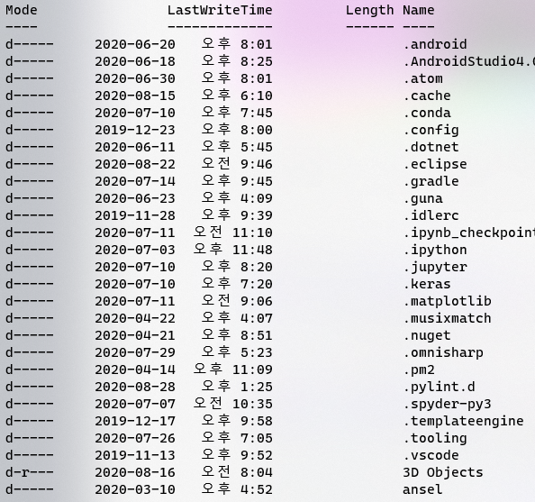
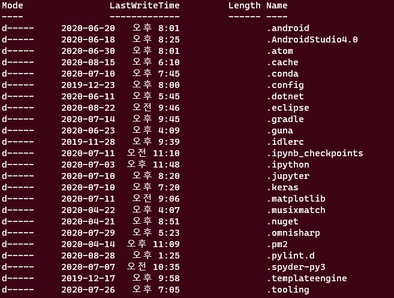
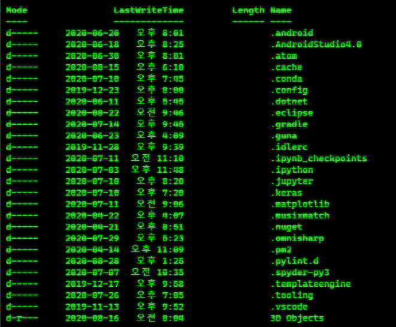
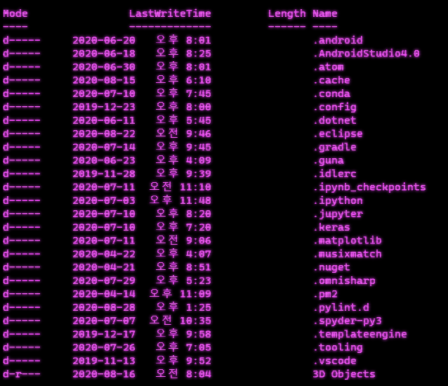

# WinTer
"Win"dow "Ter"minal Theme : 윈도우 터미널 테마 모음집

## Basic Window Theme (기본 윈도우 터미널 테마)
[바로가기](https://docs.microsoft.com/ko-kr/windows/terminal/customize-settings/color-schemes)

### Invisible (반투명)
<b>반투명 적용 코드</b>
```json
"useAcrylic": true,
"acrylicOpacity": 0.7
```
<br>
 <br>

## Raspberry Ubuntu (라즈베리 우분투 테마)
 <br>

## Retro
<b>레트로 적용 코드</b>
```json
"experimental.retroTerminalEffect": true
```
<br>
 <br>
 <br>
